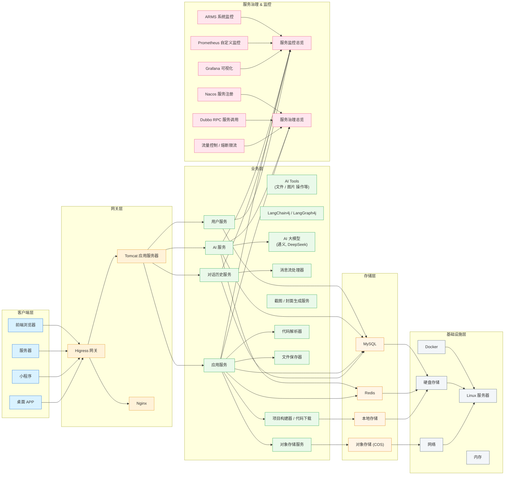
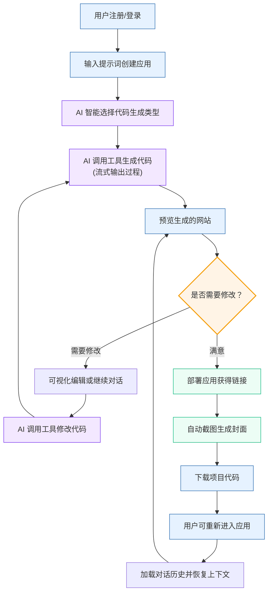

# ZWH AI 智能代码生成平台

<div align="center">


**基于 Spring Boot 3 + LangChain4j + Vue 3 的企业级 AI 代码生成平台**


</div>

---

## 🎯 项目背景与价值

### 解决的核心痛点

- **开发效率低下**: 传统 CRUD 代码编写占用开发者 60%+ 时间，重复性工作繁重
- **代码质量参差不齐**: 团队成员技术水平差异导致代码风格、性能表现不一致
- **AI 工具碎片化**: 现有 AI 编程助手功能单一，无法支持复杂业务场景的端到端代码生成
- **企业级需求缺失**: 缺乏权限管理、审计追踪、私有化部署等企业必需功能

### 项目价值

- 🚀 **效率提升**: 自然语言描述 → 完整项目代码，开发效率提升 3-5 倍
- 🎨 **标准化输出**: 基于企业级代码模板，确保生成代码符合团队规范
- 🔧 **全栈覆盖**: 支持从后端 API 到前端组件的完整技术栈代码生成
- 🏢 **企业就绪**: 内置权限管理、审计日志、私有化部署等企业级特性

---

## ⚡ 核心功能矩阵

### 🤖 AI 代码生成引擎
- [x] **多语言支持**: Java/Python/JavaScript/TypeScript 代码生成
- [x] **框架适配**: Spring Boot、Vue 3、React 项目模板生成
- [x] **智能路由**: 基于需求描述自动选择最优生成策略
- [x] **流式输出**: 实时展示代码生成过程，支持中断和重试
- [ ] **代码重构**: 现有代码智能优化建议 (v2.0 规划)
- [ ] **单元测试生成**: 自动生成对应的测试用例 (v2.1 规划)

### 🔄 企业级工作流
- [x] **并发生成**: 基于 LangGraph4j 的多任务并行处理
- [x] **状态管理**: 长任务执行状态持久化与恢复
- [x] **质量检测**: 集成代码质量预检和安全扫描
- [x] **模板管理**: 支持自定义代码模板和风格配置
- [ ] **版本管理**: Git 分支自动创建与合并 (开发中)
- [ ] **CI/CD 集成**: Jenkins/GitHub Actions 工作流集成 (v2.0 规划)

### 👥 系统管理
- [x] **用户权限**: 基于 RBAC 的多租户权限控制
- [x] **API 限流**: Redis + Redisson 分布式限流策略
- [x] **监控告警**: 实时 AI 调用量、成功率、响应时间监控
- [x] **审计日志**: 完整的用户操作和系统事件记录
- [x] **数据备份**: 自动化数据备份和恢复机制

---

## 🛠 技术栈详解

### 后端核心架构 (Spring Boot 3.2.0)

```yaml
AI 引擎层:
  LangChain4j: 0.24.0           # 核心对话能力，支持多 LLM 适配
  LangGraph4j: 1.6.0            # 复杂工作流编排，状态机管理
  OpenAI Java SDK: 0.12.0       # GPT 模型调用，支持流式响应

数据处理层:
  MyBatis-Flex: 1.7.8           # 轻量化 ORM，代码生成友好
  HikariCP: 5.0.1               # 高性能数据库连接池
  MySQL: 8.0+                   # 主数据存储
  Redis: 7.0                    # 缓存 + 分布式锁

服务治理层:
  Spring Security: 6.1.0        # 安全框架，JWT 认证
  Spring Boot Actuator          # 健康检查、指标监控
  Redisson: 3.20.1              # 分布式限流和锁机制
  Knife4j: 4.1.0                # API 文档生成
```

### 前端技术栈 (Vue 3.3.0)

```yaml
核心框架:
  Vue: 3.3.0                    # 渐进式前端框架
  TypeScript: 5.0+              # 类型安全支持
  Vite: 4.4.0                   # 快速构建工具

UI & 交互:
  Element Plus: 2.3.0           # 企业级 UI 组件库
  Monaco Editor: 0.39.0         # 代码编辑器 (VS Code 内核)
  ECharts: 5.4.0                # 数据可视化图表

状态管理:
  Pinia: 2.1.0                  # Vue 3 原生状态管理
  VueUse: 10.2.0                # Vue 组合式函数集合
```

### 基础设施

```yaml
容器化:
  Docker: 24.0+                 # 容器化部署
  Docker Compose: 2.20+         # 本地开发环境编排

监控运维:
  Prometheus: 2.45+             # 指标采集
  Grafana: 10.0+                # 监控面板
  ELK Stack: 8.8+               # 日志分析 (可选)

云服务:
  腾讯云 COS                     # 对象存储
  阿里云 OSS                     # 备选存储方案
```

---

## 🏗 系统架构

### 整体架构图



### 核心流程



---

## 🚀 快速开始

### 环境要求

| 组件 | 版本要求 | 说明 |
|------|----------|------|
| JDK | 21+ | 推荐 OpenJDK 21 |
| Maven | 3.8+ | 构建工具 |
| MySQL | 8.0+ | 主数据库 |
| Redis | 6.0+ | 缓存和会话存储 |
| Node.js | 18+ | 前端开发环境 |
| Docker | 20.0+ | 容器化部署 |

### AI 服务配置 (二选一)

#### 方案A: OpenAI API (推荐)
```bash
export OPENAI_API_KEY=sk-your-openai-api-key
export OPENAI_MODEL=gpt-4-turbo-preview
```

#### 方案B: 本地 LLM (Ollama)
```bash
# 安装 Ollama
curl -fsSL https://ollama.ai/install.sh | sh

# 下载模型
ollama pull llama3:8b
ollama pull codellama:7b

# 启动服务
ollama serve
```

### 一键部署

```bash
# 1. 克隆项目
git clone https://github.com/zwh-W/zwh-ai-code-generate-platform.git
cd zwh-ai-code-generate-platform

# 2. 启动基础服务
docker-compose up -d mysql redis

# 3. 初始化数据库
mysql -u root -p zwh_ai_platform < sql/create_table.sql

# 4. 配置应用
cp src/main/resources/application-prod-sample.yml src/main/resources/application-local.yml
# 编辑 application-local.yml，配置数据库连接和 AI 服务

# 5. 启动后端服务
mvn clean spring-boot:run

# 6. 启动前端服务 (另开终端)
cd frontend
npm install
npm run dev
```

### Docker 一键部署

```bash
# 使用 Docker Compose 一键启动所有服务
docker-compose up -d

# 查看服务状态
docker-compose ps

# 查看日志
docker-compose logs -f app
```

### 验证部署

访问以下地址验证部署成功：


- **后端API**: http://localhost:8123
- **API文档**: http://localhost:8123/doc.html
- **健康检查**: http://localhost:8123/actuator/health

### API 调用示例

```bash
# 1. 用户登录
curl -X POST http://localhost:8123/api/user/login \
  -H "Content-Type: application/json" \
  -d '{"username": "admin", "password": "admin123"}'

# 2. 生成 Spring Boot CRUD 代码
curl -X POST http://localhost:8123/api/generate/code \
  -H "Content-Type: application/json" \
  -H "Authorization: Bearer YOUR_JWT_TOKEN" \
  -d '{
    "description": "创建用户管理CRUD接口，包含分页查询、条件筛选",
    "language": "java",
    "framework": "springboot",
    "features": ["validation", "swagger", "pagination"]
  }'

# 3. 生成 Vue 3 组件
curl -X POST http://localhost:8123/api/generate/frontend \
  -H "Content-Type: application/json" \
  -H "Authorization: Bearer YOUR_JWT_TOKEN" \
  -d '{
    "description": "用户列表页面，包含搜索、分页、新增、编辑功能",
    "framework": "vue3",
    "ui": "element-plus",
    "typescript": true
  }'
```

---

## 📁 项目结构

```
zwh-ai-code-generate-platform/
├── 📁 backend/                          # 后端项目
│   ├── 📁 src/main/java/com/zwh/
│   │   ├── 📁 ai/                       # AI 服务核心
│   │   │   ├── 📁 guardrail/           # AI 安全防护
│   │   │   ├── 📁 model/               # AI 模型定义
│   │   │   ├── 📁 tools/               # AI 工具集合
│   │   │   └── 📄 AiCodeGeneratorService.java
│   │   ├── 📁 core/                     # 代码生成核心
│   │   │   ├── 📁 builder/             # 项目构建器
│   │   │   ├── 📁 handler/             # 流式处理器
│   │   │   ├── 📁 parser/              # 代码解析器
│   │   │   └── 📁 saver/               # 文件保存器
│   │   ├── 📁 langgraph4j/             # 工作流引擎
│   │   │   ├── 📁 node/                # 工作流节点
│   │   │   │   ├── 📄 CodeGeneratorNode.java
│   │   │   │   ├── 📄 QualityCheckNode.java
│   │   │   │   └── 📁 concurrent/      # 并发节点
│   │   │   ├── 📁 state/               # 状态管理
│   │   │   ├── 📁 tools/               # 工作流工具
│   │   │   └── 📄 CodeGenWorkflow.java
│   │   ├── 📁 controller/              # REST 控制器
│   │   ├── 📁 service/                 # 业务逻辑层
│   │   ├── 📁 mapper/                  # 数据访问层
│   │   ├── 📁 config/                  # 配置类
│   │   └── 📁 security/                # 安全配置
│   ├── 📁 src/main/resources/
│   │   ├── 📁 mapper/                  # MyBatis SQL 映射
│   │   ├── 📁 prompt/                  # AI 提示词模板
│   │   ├── 📁 templates/               # 代码生成模板
│   │   └── 📄 application.yml          # 应用配置
│   └── 📄 pom.xml                      # Maven 依赖配置
├── 📁 frontend/                         # 前端项目
│   ├── 📁 src/
│   │   ├── 📁 components/              # 通用组件
│   │   │   ├── 📄 CodeEditor.vue       # 代码编辑器
│   │   │   ├── 📄 ProjectTree.vue      # 项目文件树
│   │   │   └── 📄 GenerationProgress.vue # 生成进度条
│   │   ├── 📁 views/                   # 页面组件
│   │   │   ├── 📄 Dashboard.vue        # 仪表板
│   │   │   ├── 📄 CodeGeneration.vue   # 代码生成页
│   │   │   └── 📄 ProjectManagement.vue # 项目管理
│   │   ├── 📁 stores/                  # Pinia 状态管理
│   │   ├── 📁 api/                     # API 接口封装
│   │   └── 📁 utils/                   # 工具函数
│   ├── 📄 package.json                 # Node.js 依赖
│   └── 📄 vite.config.ts              # Vite 配置
├── 📁 sql/                             # 数据库脚本
│   ├── 📄 create_table.sql            # 建表脚本
│   └── 📄 init_data.sql               # 初始数据
├── 📁 docker/                          # Docker 配置
│   ├── 📄 Dockerfile.backend          # 后端镜像
│   ├── 📄 Dockerfile.frontend         # 前端镜像
│   └── 📄 docker-compose.yml          # 服务编排
├── 📁 docs/                            # 项目文档
│   ├── 📄 API.md                      # API 接口文档
│   ├── 📄 DEPLOYMENT.md               # 部署指南
│   └── 📄 DEVELOPMENT.md              # 开发指南
└── 📄 README.md                       # 项目说明
```

---

## 🔧 配置说明

### 核心配置文件

#### application.yml
```yaml
# AI 服务配置
ai:
  provider: openai  # openai | azure | ollama
  openai:
    api-key: ${OPENAI_API_KEY}
    model: gpt-4-turbo-preview
    base-url: https://api.openai.com/v1
  ollama:
    base-url: http://localhost:11434
    model: llama3:8b

# 数据库配置
spring:
  datasource:
    url: jdbc:mysql://localhost:3306/zwh_ai_platform?useSSL=false&serverTimezone=UTC
    username: ${DB_USERNAME:root}
    password: ${DB_PASSWORD:123456}
    driver-class-name: com.mysql.cj.jdbc.Driver
  
  # Redis 配置
  redis:
    host: ${REDIS_HOST:localhost}
    port: ${REDIS_PORT:6379}
    password: ${REDIS_PASSWORD:}
    timeout: 3000ms

# 业务配置
app:
  # JWT 配置
  jwt:
    secret: ${JWT_SECRET:your-secret-key}
    expiration: 86400  # 24小时
  
  # 限流配置
  rate-limit:
    default-limit: 100    # 每分钟请求数
    ai-generate-limit: 10 # AI 生成接口限制
  
  # 文件存储配置
  storage:
    type: local  # local | cos | oss
    local:
      path: ./uploads
    cos:
      secret-id: ${COS_SECRET_ID}
      secret-key: ${COS_SECRET_KEY}
      region: ${COS_REGION}
      bucket: ${COS_BUCKET}
```

### 环境变量说明

| 变量名 | 描述 | 默认值 | 必填 |
|--------|------|--------|------|
| `OPENAI_API_KEY` | OpenAI API 密钥 | - | 是* |
| `DB_USERNAME` | 数据库用户名 | root | 否 |
| `DB_PASSWORD` | 数据库密码 | 123456 | 否 |
| `REDIS_HOST` | Redis 主机地址 | localhost | 否 |
| `JWT_SECRET` | JWT 签名密钥 | - | 是 |
| `COS_SECRET_ID` | 腾讯云 COS SecretId | - | 否** |

*使用 OpenAI 时必填  
**使用云存储时必填

---

## 📊 使用场景示例

### 场景1: 生成 Spring Boot CRUD 接口

**用户输入**:
```
创建一个用户管理模块，包含：
1. 用户实体：id、用户名、邮箱、创建时间
2. CRUD 接口：增删改查、分页查询
3. 参数校验和异常处理
4. Swagger 文档注解
```

**生成结果**:
- `User.java` - 用户实体类
- `UserController.java` - REST 控制器
- `UserService.java` - 业务逻辑接口
- `UserServiceImpl.java` - 业务逻辑实现
- `UserMapper.java` - 数据访问接口
- `UserMapper.xml` - SQL 映射文件

### 场景2: 生成 Vue 3 管理页面

**用户输入**:
```
创建用户管理页面，要求：
1. 用户列表展示（表格形式）
2. 搜索功能（按用户名、邮箱）
3. 分页功能
4. 新增/编辑用户对话框
5. 删除确认功能
6. 使用 Element Plus 组件
```

**生成结果**:
- `UserManagement.vue` - 主页面组件
- `UserForm.vue` - 用户表单组件
- `userApi.js` - API 接口封装
- `user.store.js` - Pinia 状态管理

### 场景3: 全栈项目生成

**用户输入**:
```
创建一个简单的博客系统：
- 后端：文章管理、分类管理、用户认证
- 前端：文章列表、详情页、管理后台
- 数据库：文章表、分类表、用户表
```

**生成结果**: 完整的前后端分离项目，包含所有必要的文件和配置。

---

## 🔍 已知问题与解决方案

### 常见部署问题

#### 1. 端口冲突
**问题**: `Port 8123 already in use`
**解决方案**:
```bash
# 查找占用进程
lsof -i :8123
# 或修改配置文件中的端口
server:
  port: 8081
```

#### 2. AI 生成代码格式异常
**问题**: 生成的代码缺少导入语句或格式不规范
**解决方案**:
- 检查提示词模板是否完整
- 调整 AI 模型参数 `temperature` 降低随机性
- 使用代码后处理器进行格式化

#### 3. MySQL 连接失败
**问题**: `Access denied for user 'root'@'localhost'`
**解决方案**:
```bash
# 重置 MySQL 密码
mysql -u root -p
ALTER USER 'root'@'localhost' IDENTIFIED BY 'new_password';
FLUSH PRIVILEGES;
```

#### 4. Redis 连接超时
**问题**: `Could not connect to Redis at localhost:6379`
**解决方案**:
```bash
# 启动 Redis 服务
redis-server
# 或使用 Docker
docker run -d -p 6379:6379 redis:7.0
```

### 性能优化建议

1. **AI 调用优化**:
   - 启用请求缓存，相同需求复用结果
   - 使用连接池管理 HTTP 连接
   - 设置合理的超时时间

2. **数据库优化**:
   - 为频繁查询字段添加索引
   - 使用读写分离（生产环境）
   - 定期清理过期数据

3. **前端优化**:
   - 启用代码分割和懒加载
   - 使用 CDN 加速静态资源
   - 实施适当的缓存策略

---

## 🛣 开发路线图

### v1.0 (当前版本) - 核心功能
- [x] 基础代码生成能力
- [x] 用户权限管理
- [x] 工作流引擎
- [x] 监控告警

### v1.1 (开发中) - 功能增强
- [ ] 代码重构建议
- [ ] 更多编程语言支持
- [ ] 团队协作功能
- [ ] 移动端适配

### v2.0 (规划中) - 企业级特性
- [ ] 私有化 LLM 支持
- [ ] 代码安全扫描
- [ ] CI/CD 集成
- [ ] 多租户架构

### v2.1 (未来) - 智能化升级
- [ ] 自动化测试生成
- [ ] 性能分析建议
- [ ] 智能代码审查
- [ ] 知识图谱集成

---

## 🤝 贡献指南

### 开发环境搭建

1. **Fork 项目**到您的 GitHub 账户
2. **克隆项目**到本地开发环境
3. **创建开发分支**：`git checkout -b feature/your-feature-name`
4. **安装依赖**：按照[快速开始](#-快速开始)部分的说明配置环境

### 代码规范

#### 后端代码规范
- 使用 Google Java Style Guide
- 类和方法必须有完整的 Javadoc 注释
- 单元测试覆盖率不低于 80%
- 使用 CheckStyle 进行代码检查

#### 前端代码规范
- 使用 ESLint + Prettier 进行代码格式化
- 组件必须有 TypeScript 类型定义
- 使用 Vue 3 Composition API
- 遵循 BEM CSS 命名规范

#### 提交规范
使用 [Conventional Commits](https://www.conventionalcommits.org/) 规范：

```
<type>[optional scope]: <description>

[optional body]

[optional footer(s)]
```

**类型说明**:
- `feat`: 新功能
- `fix`: 修复 bug
- `docs`: 文档更新
- `style`: 代码格式调整
- `refactor`: 代码重构
- `test`: 测试相关
- `chore`: 构建过程或辅助工具的变动

**示例**:
```bash
git commit -m "feat(ai): add support for Claude API integration"
git commit -m "fix(frontend): resolve code editor syntax highlighting issue"
git commit -m "docs(readme): update deployment instructions"
```

### Pull Request 流程

1. **确保代码质量**
   ```bash
   # 运行测试
   mvn test
   npm run test
   
   # 代码检查
   mvn checkstyle:check
   npm run lint
   ```

2. **提交 PR**
   - 提供清晰的 PR 标题和描述
   - 关联相关的 Issue
   - 添加必要的截图或演示

3. **代码审查**
   - 至少需要一名维护者审查
   - 解决所有审查意见
   - 确保 CI 检查通过

4. **合并要求**
   - 分支必须基于最新的 `main` 分支
   - 所有测试必须通过
   - 代码覆盖率不能下降

### 问题报告

提交 Issue 时请包含：
- **环境信息**: 操作系统、Java 版本、浏览器版本等
- **重现步骤**: 详细的操作步骤
- **预期结果**: 您期望发生什么
- **实际结果**: 实际发生了什么
- **错误日志**: 相关的错误信息或日志
- **截图**: 如果适用，提供截图

---

## 📈 监控与运维

### 监控指标

#### 业务指标
- AI 生成成功率
- 平均响应时间
- 用户活跃度
- 代码生成量统计

#### 技术指标
- JVM 内存使用率
- 数据库连接池状态
- Redis 缓存命中率
- API 请求量和错误率

### 监控面板

访问 Grafana 面板查看实时监控数据：
- **系统概览**: http://localhost:3001/d/system-overview
- **业务指标**: http://localhost:3001/d/business-metrics
- **错误分析**: http://localhost:3001/d/error-analysis

### 日志管理

#### 日志级别配置
```yaml
logging:
  level:
    com.zwh: INFO
    com.zwh.ai: DEBUG  # AI 服务详细日志
    org.springframework.security: WARN
  pattern:
    console: "%d{yyyy-MM-dd HH:mm:ss} [%thread] %-5level %logger{36} - %msg%n"
    file: "%d{yyyy-MM-dd HH:mm:ss} [%thread] %-5level %logger{36} - %msg%n"
  file:
    name: logs/zwh-ai-platform.log
    max-size: 100MB
    max-history: 30
```

#### 关键日志位置
- **应用日志**: `logs/zwh-ai-platform.log`
- **AI 调用日志**: `logs/ai-service.log`
- **审计日志**: `logs/audit.log`
- **错误日志**: `logs/error.log`

---

## 🔐 安全说明

### 安全特性

1. **身份认证**
   - JWT Token 认证
   - 密码加密存储 (BCrypt)
   - 会话管理和超时控制

2. **权限控制**
   - 基于角色的访问控制 (RBAC)
   - 接口级权限验证
   - 资源隔离和多租户支持

3. **数据安全**
   - SQL 注入防护
   - XSS 攻击防护
   - CSRF 令牌验证

4. **API 安全**
   - 请求限流和防刷
   - IP 白名单支持
   - API 密钥管理

### 安全配置建议

#### 生产环境安全检查清单

- [ ] 修改默认密码和密钥
- [ ] 启用 HTTPS
- [ ] 配置防火墙规则
- [ ] 启用审计日志
- [ ] 定期备份数据
- [ ] 更新安全补丁
- [ ] 配置监控告警

#### 敏感信息管理

```bash
# 使用环境变量管理敏感信息
export JWT_SECRET=$(openssl rand -base64 32)
export DB_PASSWORD=$(openssl rand -base64 16)
export OPENAI_API_KEY=your-openai-api-key

# 或使用 Docker Secrets (生产环境推荐)
docker secret create jwt_secret jwt_secret.txt
docker secret create db_password db_password.txt
```

---

## 📄 许可证

本项目基于 [MIT License](LICENSE) 开源协议发布。

```
MIT License

Copyright (c) 2025 张蘶豪 (ZWH)

Permission is hereby granted, free of charge, to any person obtaining a copy
of this software and associated documentation files (the "Software"), to deal
in the Software without restriction, including without limitation the rights
to use, copy, modify, merge, publish, distribute, sublicense, and/or sell
copies of the Software, and to permit persons to whom the Software is
furnished to do so, subject to the following conditions:

The above copyright notice and this permission notice shall be included in all
copies or substantial portions of the Software.

THE SOFTWARE IS PROVIDED "AS IS", WITHOUT WARRANTY OF ANY KIND, EXPRESS OR
IMPLIED, INCLUDING BUT NOT LIMITED TO THE WARRANTIES OF MERCHANTABILITY,
FITNESS FOR A PARTICULAR PURPOSE AND NONINFRINGEMENT. IN NO EVENT SHALL THE
AUTHORS OR COPYRIGHT HOLDERS BE LIABLE FOR ANY CLAIM, DAMAGES OR OTHER
LIABILITY, WHETHER IN AN ACTION OF CONTRACT, TORT OR OTHERWISE, ARISING FROM,
OUT OF OR IN CONNECTION WITH THE SOFTWARE OR THE USE OR OTHER DEALINGS IN THE
SOFTWARE.
```

---

## 👨‍💻 维护者信息

<div align="center">

### 张蘶豪 (ZWH)

**后端开发工程师 | AI 应用开发**

[](https://github.com/zwh-W)
[](mailto:your-email@example.com)
[](https://linkedin.com/in/your-profile)

**专业技能**: Spring Boot | Vue.js | AI/ML | 系统架构设计  
**项目经验**: 1+ 年企业级应用开发，1+ 年 AI 应用开发经验

</div>

### 技术栈专长

- **后端开发**: Spring Boot, MyBatis, Redis, MySQL, 微服务架构
- **前端开发**: Vue 3, TypeScript, Element Plus, 响应式设计
- **AI/ML**: LangChain, OpenAI API, 提示工程, RAG 架构
- **DevOps**: Docker, K8s, CI/CD, 监控运维

### 联系方式

- **技术交流**: 欢迎通过 GitHub Issues 讨论技术问题
- **商业合作**: 请发送邮件至 1840816813@qq.com
- **项目咨询**: 提供项目定制开发和技术咨询服务

---

<div align="center">

## 🌟 致谢

感谢所有为本项目做出贡献的开发者！

[](https://github.com/zwh-W/zwh-ai-code-generate-platform/graphs/contributors)

**如果这个项目对您有帮助，请给它一个 ⭐ Star！**

[回到顶部](#zwh-ai-智能代码生成平台)

</div>
